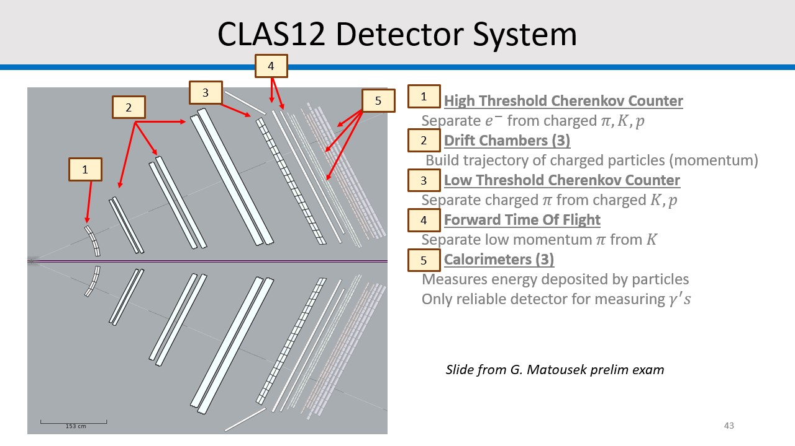

# CLAS12 Data Analysis Tutorial

This repository contains a tutorial on how to analyze data from the CLAS12 experiment. The tutorial provides step-by-step instructions and code examples to guide you through the data analysis process using the CLAS12 software framework. (For beginners, see Step 3 in [Setup](#setup) for instructions on how to clone this repository)

## Table of Contents

- [Introduction](#introduction)
- [Setup](#setup)
- [Details](#details)
- [Example A: Python Only](#Python-Only-Analysis)
- [Example B: C++/Python](#Cpp-and-Python-Analysis)
- [Example C: Faraday Cup Analysis](#Faraday-Cup-Analysis)
- [Example D: Reading the RCDB](#RCDB-Analysis)
- [Contact](#contact)

## Introduction

The CLAS12 detector system measures the final state products of fixed target electron-nucleon scattering. It does so using a family of detectors, each with their own unique purpose. For my research, I have only use the *forward detector* (FD for short) which corresponds to the set of CLAS12 subsystems which cover electron scattering angles of 5 to 35 degrees off the beam lines. These subsystems are listed and briefly described in the image below. For more information about the detectors, please [read more here](https://www.sciencedirect.com/science/article/pii/S0168900220300243).



In this repository, I will be showcasing how to analyze simple inclusive DIS events. This corresponds to the process *e+p --> e' + X* where *e* and *e'* are the initial and final state electrons, *p* is the initial proton (at rest), and *X* is the unmeasured hadronic state. We will be looking at real, collected CLAS12 data from the [RG-A experiment](https://clasweb.jlab.org/wiki/index.php/Run_Group_A#tab=Current_status) which ran in the years 2018 and 2019 with a polarized electron beam and unpolarized proton target. In addition, we will be looking at Monte Carlo simulations of these very same collisions.  The end goal is to be able to calculate the event kinematics (x, Q2, y, etc.) and particle kinematics (electron energy, electron scattering angle) for each collision and produce some figures.

This tutorial is will complete this task in two separate ways. First, the **python-only** route will utilize the python package `hipopy` ([written by Matthew McEneaney](https://pypi.org/project/hipopy/)) to read the collision data, then also use python to perform some postprocessing and plotting. Second, the much faster **C++/python** route will utilize the package `clas12root` ([see documentation](https://github.com/JeffersonLab/clas12root)) to read the collision data, then use python to perform the postprocessing and plotting.

Lastly, the data we will analyze is stored in files with a .hipo extension, typically referred to as "hipo files". They are compressed in a way to save on storage space and have, at least when you first start with CLAS, a convoluted way of being read. I am hoping this tutorial will introduce the basics and give you a foundation to build off of. 

## Setup

For this tutorial, I will be assuming you have connection to Jefferson Lab's ifarm and have your own directory in `/work/clas12/users/` or some equivalent. 

1. The first step is to obtain access to a Jupyter-Notebook via the web that links to your filesystem on the farm. This is ideal for programming long scripts, creating/testing analysis macros, and viewing plots. There will be some limitations to this which will we get to later, but for now, -->   [visit here](https://scicomp.jlab.org/docs/JupyterHub)   <-- and follow the instructions for obtaining your kernel.
When creating your kernel, use the **CLAS12** notebook image. By default, the kernel opens your home directory on the farm at `/home/<USERNAME>/`. Since this directory has a limited storage space, I would reccommend you do all your programming in your `/work` directory or some equivalent. It may be helpful to provide a quick file link to your `/work` from your default `/home` directory, this way whenever you open Jupyter-Notebook on ifarm you can open your work directory with a single click. To set this up on ifarm, do `ln -s /path/to/work/directory /home/<USERNAME>/link_to_workspace`. This will create a link called "link_to_workspace" in your home directory that you can double click while using Jupyter to enter you work directory. 

2. Next, we need to install several python packages for our analysis. Since all our python analysis will be compiled within Jupyter-Notebook, we must make sure the python packages are installed there. On your notebook page, click the blue `+` button on the top left and create a Terminal. Then, in this terminal, install the following python packages by running...
```
pip install numpy matplotlib hipopy pymysql six sqlalchemy pandas PyMySQL
```
The package `hipopy` will be used for simple reading of the CLAS12 data with python, albeit slowly. 

3. Now, you will want to clone this repository somewhere in your work directory. Using either the terminal on Jupyter or when ssh'd into ifarm from your home PC, go to your work directory and run...
```
git clone https://github.com/Gregtom3/clas12_tutorial/
```

4. As mentioned earlier, we will be using C++ at some point to read the collision data faster than python could ever hope to do. Historically, software development for CLAS was done mainly in Java. The consequence of this is that you will need to install the program `clas12root` which is a sort of go-between for processing in C++. Luckily, this program is able to be accessed directly on ifarm using `module`. To do so, you will need to start by editing you `~/.cshrc` in your home directory on ifarm (this can be done using the ssh terminal). Add the following lines...
```
source /group/clas12/packages/setup.csh
module load clas12/pro

set PATH=${PATH}:${CLAS12ROOT}/bin
set RCDB_HOME=${CLAS12ROOT}/rcdb
set CCDB_HOME=${CLAS12ROOT}/ccdb
source ${CCDB_HOME}/environment.csh
set QADB=${CLAS12ROOT}/clasqaDB
```
then close and reopen your terminal. This will use the `module` command to load several programs (which can all be viewed by typing `module list`), including clas12root, every time you open your terminal. Similar to how `root` can be used to compile a C++ program and run it, `clas12root` can be used to compile a C++ program *that may be using hipo-related code* and run it ([see documentation](https://github.com/JeffersonLab/clas12root)). 

To make sure the setup worked, you should be able to type `clas12root` and receive the ROOT terminal as expected.

---

## Details

With the setup complete, we can now talk about the *hipo* files. As mentioned before, these are large data files that store the collision information. They are readily accessible on ifarm, so long as you know the path to them. 

There is a quick subtely to talk about, first. Suppose you have beam for 4 hours, collect the collision data (could be as much as 100M electron triggers) on disk, and store it. When it comes time for people to analyze that 4 hours of data, it would be **arduous** for everyone to have to convert the raw detector response from 5 or more detectors to form your particles. To mitigate this, a preprocessing stage called *cooking* is taken over by workers called *chefs* (yes, thats right) that run an intensive simulation job on the raw data to produce more meaningful, easier to analysis hipo files. 

For a given raw hipo file, the cooking process produces several "watered-down" hipo files from the parent, each corresponding to a different "train". For studying SIDIS, for example, we use either the "nSidis" or "sidisdvcs" train (depending on the run-group's naming convention) because those reduced hipo files only list events with a trigger electron satisfying a few DIS cuts (W>2, Q2>1, y<0.8). There are many other trains, and the documentation can be typically found in the parent directory of the hipo files (ex: /cache/clas12/rg-a/production/recon/fall2018/torus-1/pass1/v1/dst/train/README.json). 

Here's a Markdown table representing the paths to different directories containing files, labeled with the run group (With MC for Monte Carlo), beam energy, torus polarization, and number of files:

| Run Group | Beam Energy (GeV) | Torus Polarization | Number of Files | Directory Path |
|-----------|-------------|--------------------|-----------------|----------------|
| MC rg-a      | 10.604          | -1                 | 220               | /cache/clas12/rg-a/production/montecarlo/clasdis/fall2018/torus-1/v1/bkg45nA_10604MeV/ |
| MC rg-a      | 10.604          | +1                 | 25               | /cache/clas12/rg-a/production/montecarlo/clasdis/fall2018/torus+1/v1/bkg50nA_10604MeV/ |
| rg-a      | 10.6041      | -1                 | 174               | /cache/clas12/rg-a/production/recon/fall2018/torus-1/pass1/v1/dst/train/nSidis/ |
| rg-a      | 10.6041      | +1                 | 186               | /cache/clas12/rg-a/production/recon/fall2018/torus+1/pass1/v1/dst/train/nSidis/ |
| rg-a      | 10.1998      | -1                 | 121               | /cache/clas12/rg-a/production/recon/spring2019/torus-1/pass1/v1/dst/train/nSidis/ |
| rg-b      | 10.5986   | -1                 | 249               | /cache/clas12/rg-b/production/recon/spring2019/torus-1/pass1/v0/dst/train/sidisdvcs/ |
| rg-b      | 10.4096   | +1                 | 107               | /cache/clas12/rg-b/production/recon/fall2019/torus+1/pass1/v1/dst/train/sidisdvcs/ |
| rg-b      | 10.3894   | -1                 | 181               | /cache/clas12/rg-b/production/recon/spring2020/torus-1/pass1/v1/dst/train/sidisdvcs/ |
| MC rg-c      | 10.5          | ?                 | 999               | /work/cebaf24gev/sidis/reconstructed/polarized-plus-10.5GeV-proton/hipo/ |
| MC rg-c      | 10.5          | ?                |  649            | /work/cebaf24gev/sidis/reconstructed/polarized-plus-10.5GeV-neutron/hipo/ |
| rg-c      | 10.5593   | ?                | 25 (as of 5/16/2023)           | /volatile/clas12/rg-c/production/dst/8.7.0_TBT/dst/train/sidisdvcs/ |

*it is important to note that since the rg-c data is still in the process of being cooked, the number of files and its directory path will change*.

In this tutorial, we will be looking at the first cooked run of the RG-A experiment, Run 5032. For your own intrigue, you can learn more about the **R**un **C**onditions for 5032 in the following **D**ata**b**ase (the RCDB) --> [5032](https://clasweb.jlab.org/rcdb/runs/info/5032). The list of the RCDB conditions is documented [here](https://clasweb.jlab.org/rcdb/conditions/)

The `.hipo` files store data event-by-event (with some exceptions) in separate callable "banks". One of the most common hipo banks (produced after cooking) is `REC::Particle`, which stores a csv-like spreadsheet of particle information for each event. This bank is incredibly useful because it is our gateway for gathering the particles for each event and analyzing them. Also, the particle identification number (`pid`) of each candidate particle is stored. For more information on how a `pid` is assigned to each particle, see the [RG-A analysis note](https://clas12-docdb.jlab.org/cgi-bin/DocDB/private/ShowDocument?docid=897). To learn more about what the pid is for each particle, check out [this resource](https://pdg.lbl.gov/2007/reviews/montecarlorpp.pdf). Other banks store detector information per event, such as `REC::Calorimeter`. An amazing feature of these banks is that each particle in `REC::Particle` has a `pindex` (its index in the bank, starting at 0) which is cross-listed in other banks. For example, an energy deposition in the PCAL is tagged with a `pindex` during cooking, letting the analyist know that the first particle in `REC::Particle` deposited energy there. 

### Looking at a hipo file in terminal

The best way to get a feel for the hipo bank structure is to open one in the terminal. Lets open that Run 5032 from RG-A and view `REC::Particle` in event 100. To do so, run...

```
hipo-utils -dump /cache/clas12/rg-a/production/recon/fall2018/torus-1/pass1/v1/dst/train/nSidis/nSidis_005032.hipo

Choose (n=next,p=previous, q=quit, h=help), Type Bank Name or id : goto 99

Choose (n=next,p=previous, q=quit, h=help), Type Bank Name or id : n

Choose (n=next,p=previous, q=quit, h=help), Type Bank Name or id : REC::Particle
```

You can see any of the other banks by typing their name.

After this tutorial, I urge you to check out this [useful wiki](https://clasweb.jlab.org/wiki/index.php/CLAS12_DSTs) which goes over the documentation for the different DSTs (data structures, i.e. hipo banks). 

---

## Python Only Analysis

From `examples/ex_A_python_only.ipynb` we use `hipopy` to read the banks within the `hipo` file. We determine a scattered electron as the highest energy `pid==11` particle in REC::Particle. We require the electron's energy to be greater than `2.5 GeV`. Then, we apply a basic example of a detector cut on the electron, requiring its PCAL energy deposition to be no less than `100 MeV`. For events that pass this cut, we record the electron's kinematics and the event variables x, Q2, y, and W. 

We then make plots of the recorded variables using `matplotlib.pyplot`. 

Since we are using python to parse the `hipo` file, we are limited by the computational speed of python. Unfortunately, it is quite slow, which is why we only analyze by default 3,000 events in the hipo file, out of 526,752 (for nSidis 5032).  This is why we must turn to C++ for computations over the full file if we want any chance at having a quick analysis script.

---

## Cpp and Python Analysis

This stage is broken apart into two steps: processing and plotting. To process the hipo file using C++...

1. `cd examples/`
2. `clas12root ex_B1_clas12root.C`

In the processing stage, we apply the same scattered electron cuts defined in the python-only analysis. However, since we use C++ and `clas12root`, the processing speed is much faster, meaning we can analyze the entire 500k event file in around 30 seconds. The output of the processing code is a `.root` file stored in `data/`. This `.root` file contains a TTree with both event and particle kinematics information corresponding to events that passed the cuts. In addition, we store the run number, event number, torus bending sign, and event-by-event helicity. 

To plot, we open the notebook `examples/ex_B2_clas12root.ipynb`. Here, we load in the `.root` file created in the previous step and make a grid of plots for each of the branch variables. 

A sample 2-d binning plotting code is provided as well. Here, we define rectangular bins in the x-Q2 phase space, and plot the momentum distribution of electrons within each x-Q2 bin. 

---

## Faraday Cup Analysis

A sample script `examples/ex_C_fcupgated.C` is included to show how to read the Faraday Cup charge for a given RG-C run. It reads the `HEL::Scaler` bank to sum the accumulated charge for each helicity configuration. It then outputs these values. 

As a side note, the `HEL::scaler` bank is produced during cooking from the data stored in the `RAW::scaler` bank, which should not (to my knowledge) be in the cooked hipo files. Details about this can be found in [this wiki](https://clasweb.jlab.org/wiki/index.php/CLAS12_DSTs#Special_Banks) and [this document](https://github.com/JeffersonLab/clas12-offline-software/raw/development/common-tools/clas-detector/doc/Scaler%20information%20in%20CLAS12%202018%20data.docx)

---

## RCDB Analysis

A sample script `examples/ex_D_readRCDB.py` is included to show how to read in values from the RCDB. To run the code, provide it with a list of `hipo` files, followed by the RCDB condition you'd like to see outputted. Below I show the usage by putting two hipo file arguments, followed by the condition "events_rate". The list of the RCDB conditions is documented [here](https://clasweb.jlab.org/rcdb/conditions/):

```
python ex_D_readRCDB.py /volatile/clas12/rg-c/production/dst/8.7.0_TBT/dst/train/sidisdvcs/sidisdvcs_016352.hipo /volatile/clas12/rg-c/production/dst/8.7.0_TBT/dst/train/sidisdvcs/sidisdvcs_016353.hipo events_rate
```

Note that this program pulls the "run numbers" from the hipo files, which was useful, at the time, for my analysis. You can edit this code, which should be good practice (or you can use ChatGPT ;) ) to read in **run numbers** as opposed to **files**.

---

## Super Useful Links

- [CLAS12 Discourse Forum](https://clas12.discourse.group/)

---

## Contact 

Author: Gregory Matousek

Institution: Duke University

Email: gregory.matousek@duke.edu

